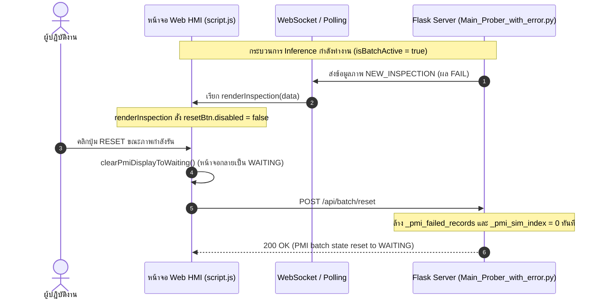

# สาเหตุที่ปุ่ม Reset สามารถกดได้ขณะทำ Inference (PMI Inspection)

เอกสารนี้สรุปผลการวิเคราะห์ปัญหา **ปุ่ม RESET (`#pmi-reset-btn`) สามารถกดได้ในขณะที่ระบบกำลังรัน Inference / Live Inspection** บนระบบตรวจสอบ PMI ของเครื่อง Prober

---

## 1. ภาพรวมของปัญหา (Problem Overview)

ในระหว่างที่ระบบกำลังทำการตรวจสอบชิ้นงานแบบสด (Live Inspection) หรือกำลังรัน Inference ตามรอบของ Batch (สถานะ `isBatchActive = true`) ผู้ใช้งานยังคงสามารถกดปุ่ม **RESET** บนหน้าจอ HMI ได้ ซึ่งเมื่อกดแล้วระบบจะทำการ:
1. ล้างหน้าจอแสดงผลกลับเป็นสถานะ `WAITING` ทันที (`clearPmiDisplayToWaiting()`)
2. ส่งคำร้องขอ `POST /api/batch/reset` ไปยัง Backend เพื่อรีเซ็ตดัชนีภาพจำลองและล้างประวัติของเสียที่ตรวจพบ

พฤติกรรมนี้ทำให้รอบการตรวจสอบที่กำลังรันอยู่หยุดชะงัก หรือข้อมูลประวัติการตรวจในรอบนั้นสูญหายก่อนที่กระบวนการจะเสร็จสมบูรณ์

---

## 2. การวิเคราะห์สาเหตุที่แท้จริง (Root Cause Analysis)

สาเหตุหลักเกิดจากการทำงานร่วมกันระหว่าง **Frontend ([script.js](file:///home/nxp1/Desktop/PUNPUNJA/Prober_machine_punmerge_ver/script.js))** และ **Backend ([Main_Prober_with_error.py](file:///home/nxp1/Desktop/PUNPUNJA/Prober_machine_punmerge_ver/Main_Prober_with_error.py))** ดังนี้:

### 2.1 ฝั่ง Frontend ([script.js](file:///home/nxp1/Desktop/PUNPUNJA/Prober_machine_punmerge_ver/script.js))

#### (1) การปลดล็อคปุ่มแบบไม่มีเงื่อนไขในฟังก์ชัน `renderInspection()`
- **ตำแหน่ง:** `script.js` (บรรทัดที่ 3642–3645)
- **โค้ด:**
  ```javascript
  // 4. Allow operator to acknowledge/reset inspection
  if (resetBtn) {
    resetBtn.disabled = false;
  }
  ```
- **สาเหตุ:** ทุกๆ ครั้งที่มีภาพผลการตรวจส่งมา ฟังก์ชัน `renderInspection()` จะถูกเรียกเสมอ (ทั้งในระหว่างสตรีมสด `isLive = true` หรือการตรวจทานย้อนหลัง) และในตอนท้ายของฟังก์ชันจะสั่งให้ `resetBtn.disabled = false` เสมอ ทำให้ปุ่ม RESET ถูกเปิดให้กดได้ตลอดเวลาในทุกๆ เฟรมที่มีการเรนเดอร์ภาพ

#### (2) WebSocket Event `NEW_INSPECTION` สั่งเปิดปุ่มทันทีที่พบของเสีย
- **ตำแหน่ง:** `script.js` (บรรทัดที่ 3916–3924)
- **โค้ด:**
  ```javascript
  const dec = (item.decision || item.ai_decision || (item.is_pass === false ? 'FAIL' : (item.is_pass ? 'PASS' : '')) || '').toUpperCase();
  if (dec === 'FAIL' || dec === 'FAILED') {
    const itemFname = getFilenameFromData(item);
    const exists = failedInspections.some(f => getFilenameFromData(f) === itemFname);
    if (!exists) {
      failedInspections.push(item);
    }
    if (resetBtn) resetBtn.disabled = false;
  }
  ```
- **สาเหตุ:** แม้ว่ารอบ Batch จะยังรันไม่จบ แต่เมื่อตรวจเจอของเสีย (FAIL) ระบบจะสั่งเปิดปุ่ม RESET ทันทีเพื่อให้ Operator รับทราบ ซึ่งทำให้ผู้ปฏิบัติงานสามารถกดรีเซ็ตได้ตั้งแต่ยังตรวจไม่เสร็จ

#### (3) กลไก Polling (`fetchPmiState()`) สั่งเปิดปุ่มถ้ามีชิ้นงาน FAIL
- **ตำแหน่ง:** `script.js` (บรรทัดที่ 3834–3838)
- **โค้ด:**
  ```javascript
  } else if (isBatchActive && !isNavigatingFailures) {
    if (prevBtn) prevBtn.disabled = true;
    if (nextBtn) nextBtn.disabled = true;
    if (resetBtn) resetBtn.disabled = (failedInspections.length === 0);
  }
  ```
- **สาเหตุ:** ในขณะที่ `isBatchActive = true` ปุ่มเลื่อนดูภาพ (`prevBtn`, `nextBtn`) ถูกล็อคเป็น `disabled = true` อย่างถูกต้อง แต่สำหรับ `resetBtn` กลับใช้เงื่อนไข `(failedInspections.length === 0)` หมายความว่า หากมีของเสียในรายการสะสมมากกว่า 0 ชิ้น ปุ่ม RESET จะถูกสั่งเป็น `disabled = false` (เปิดใช้งาน) ทันที

#### (4) ตัวดักจับการคลิก (Event Listener) ขาดการตรวจสอบสถานะ `isBatchActive`
- **ตำแหน่ง:** `script.js` (บรรทัดที่ 4027–4040)
- **โค้ด:**
  ```javascript
  if (resetBtn) {
    resetBtn.addEventListener('click', (e) => {
      e.stopPropagation();
      clearPmiDisplayToWaiting();

      // Call backend reset API
      const base = activeApiBase || IMX8_HTTP_BASE;
      fetch(`${base}/api/batch/reset`, { method: 'POST', cache: 'no-store' }).catch(() => {});
      ...
    });
  }
  ```
- **สาเหตุ:** เมื่อเทียบกับ Keyboard Navigation (บรรทัดที่ 4007) ที่มีการป้องกันไว้:
  ```javascript
  if (failedInspections.length === 0 || isBatchActive) return;
  ```
  ที่ปุ่ม `resetBtn` กลับไม่มีการตรวจเช็ค Guard Clause `if (isBatchActive) return;` ทำให้เมื่อเกิดการคลิก ไม่ว่าระบบจะรันอยู่หรือไม่ ฟังก์ชันรีเซ็ตและคำขอยิง API ก็จะทำงานทันที

---

### 2.2 ฝั่ง Backend ([Main_Prober_with_error.py](file:///home/nxp1/Desktop/PUNPUNJA/Prober_machine_punmerge_ver/Main_Prober_with_error.py))

#### ไม่มีกลไกตรวจเช็ค State Lock ที่ Endpoint `/api/batch/reset`
- **ตำแหน่ง:** `Main_Prober_with_error.py` (บรรทัดที่ 2606–2614)
- **โค้ด:**
  ```python
  @self.app.route('/api/batch/reset', methods=['POST', 'GET'])
  def pmi_batch_reset():
      self._pmi_failed_records = []
      self._pmi_sim_index = 0
      self._pmi_last_update = time.time()
      return jsonify({
          "status": "success",
          "message": "PMI batch state reset to WAITING"
      })
  ```
- **สาเหตุ:** เซิร์ฟเวอร์ Flask ยอมรับและประมวลผลคำสั่งรีเซ็ตเสมอโดยไม่มีการตรวจสอบว่าขณะนั้นกำลังอยู่ในระหว่างการทำ Inference หรือ Batch Execution หรือไม่ เมื่อมีการส่ง Request เข้ามา ข้อมูลจำลองและประวัติความผิดพลาดจะถูกล้างทันที

---

## 3. แผนผังลำดับการเกิดปัญหา (Sequence Diagram)



---

## 4. ผลกระทบ (Impact)

1. **สูญเสียข้อมูลผลการตรวจสอบ (Data Loss):** ประวัติของเสีย (`failedRecords`) ที่ตรวจพบใน Batch นั้นจะถูกล้างทิ้งทันที ทั้งที่ยังตรวจไม่ครบทุกแผ่น
2. **สถานะแสดงผลไม่สอดคล้อง (UI Inconsistency):** หน้าจอถูกเปลี่ยนเป็น `WAITING` ทั้งที่ฮาร์ดแวร์หรือกล้องอาจจะยังส่งภาพเข้ามาเรื่อยๆ
3. **ไฟล์ Judge สรุปผลคลาดเคลื่อน:** ไฟล์สรุปผล (`{decision}_JUDGE_{wafer}_{timestamp}.txt`) อาจไม่ถูกสร้างหรือผลการประเมินผิดพลาดเนื่องจากรอบการตรวจถูกขัดจังหวะ

---

## 5. แนวทางการแก้ไขในอนาคต (Recommendations)

1. **Frontend ([script.js](file:///home/nxp1/Desktop/PUNPUNJA/Prober_machine_punmerge_ver/script.js)):**
   - ในฟังก์ชัน `renderInspection()` ให้ปลดล็อคปุ่มเฉพาะเมื่อ `!isBatchActive` เท่านั้น
   - ใน Event Listener ของ `resetBtn` ให้ใส่ Guard:
     ```javascript
     if (isBatchActive) {
       console.warn('[PMI] Cannot reset while batch inspection is active');
       return;
     }
     ```
   - อนุญาตให้ปุ่ม RESET ใช้งานได้เฉพาะเมื่อ:
     - Batch ทำงานเสร็จสมบูรณ์แล้ว (`handleBatchComplete`)
     - อยู่ในโหมดดูของเสียย้อนหลัง (`isNavigatingFailures = true`)
     - หรือไม่มีกระบวนการตรวจสอบใดๆ กำลังทำงานอยู่

2. **Backend ([Main_Prober_with_error.py](file:///home/nxp1/Desktop/PUNPUNJA/Prober_machine_punmerge_ver/Main_Prober_with_error.py)):**
   - เพิ่มการตรวจสอบสถานะการทำงาน (เช่น flag `_pmi_is_running`) ก่อนยอมรับคำสั่ง `/api/batch/reset` หากกำลังรันอยู่ให้ตอบกลับเป็นข้อความเตือนหรือข้อผิดพลาด
